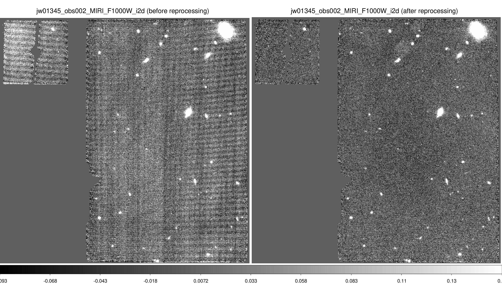

# Reprocessing MIRI with Image-for-Image Background Subtraction

## Aim

MIRI imaging suffers from severe background issue. This example shows how to use multiple visit/exposure data to construct a "dark" like observation as a background, then use the jwst pipeline stage2 `calwebb_image2. Image2Pipeline.bkg_subtract` to subtract the background. 

## How to

### Preparation

Assuming that:

- this toolkit is downloaded into `$HOME/Cloud/Github/Crab.Toolkit.JWST` and system variables are set properly (see [[reducing\_one\_dataset]](reducing_one_dataset.md))
- MIRI imaging data have already been reduced througth stages 1-3, with 
- stage3 mosaic image at `./calibrated3_mosaics/jw01345_obs002_MIRI_F1000W/jw01345_obs002_MIRI_F1000W_i2d.fits`, 
- stage3 mosaic asn file at `./calibrated3_mosaics/jw01345_obs002_MIRI_F1000W_asn.json`, 
- stage2 cal file at `../jw01345002001_04101_00001_mirimage/calibrated2_cals/jw01345002001_04101_00001_mirimage_cal.fits`,
- stage1 rate file at `../jw01345002001_04101_00001_mirimage/calibrated1_rates/jw01345002001_04101_00001_mirimage_rate.fits`,
- and same for many other datasets with the same detector.


### Mask out source emission

Now we need to detect bright source emission and mask out them. 

```
go-jwst-imaging-stage-3-step-2-make-dark-rates.sh \
    ./calibrated3_mosaics/jw01345_obs002_MIRI_F1000W/jw01345_obs002_MIRI_F1000W_i2d.fits \
    ./calibrated3_mosaics/jw01345_obs002_MIRI_F1000W_asn.json
```

This script includes two substeps:

1. Running the script `util_detect_source_and_create_seed_image.py` to detect source emission in the mosaic image and output `./calibrated3_mosaics/jw01345_obs002_MIRI_F1000W/jw01345_obs002_MIRI_F1000W_i2d_galaxy_seed_image.fits`. 
2. Running the script `util_mask_rate_data_with_seed_image.py` for each rate file to apply the source emission mask to the rate file, and to output `./jw01345002001_04101_00001_mirimage/calibrated1_rates/jw01345002001_04101_00001_mirimage_masked_source_emission_rate.fits` (and the same for other visits/exposures with the same detector). 


### Merge source-emission-masked rate files from other visits/exposures

Now we want to merge the source-emission-masked rate files from other visits/exposures to form a dark rate for each dataset. The merged dark rate is different for each dataset because we always exclude itself and merge all other visits/exposures. Because of the dithering, the holes where source emission are masked will be median-filled during the merging. 

```
go-jwst-imaging-stage-3-step-3-merge-dark-rates.sh \
    ./calibrated3_mosaics/jw01345_*_MIRI_F1000W_asn.json
```

This script includes two substeps:

1. Running the script `util_merge_source_emission_masked_rate_data.py` to make a merged dark rate for each dataset as aforementioned. This outputs `./jw01345002001_04101_00001_mirimage/calibrated1_rates/merged_other_visits_masked_source_emission_rate.fits` and a `*.list.txt` at the same location listing which files are merged.
2. Running the script `go-jwst-imaging-stage-2-step-3-redo-bkgsub.py` with the `--darkobs` option to apply the Image-for-Image background subtraction. This uses the jwst pipeline's `calwebb_image2.Image2Pipeline.bkg_subtract` component. The output is `./jw01345002001_04101_00001_mirimage/calibrated2_cals/jw01345002001_04101_00001_mirimage_bkgsub_masked_source_emission_cal.fits` and a `*_asn.json` file at the same location which is used by the jwst pipeline. 


### Stage 3: cal -> i2d (drizzling mosaic image)

Now we can run the jwst pipeline stage3 `calwebb_image3` to make a mosaic image with the new "cal.fits" files.

```
go-jwst-imaging-stage-3-step-1.py \
    ./jw01345002001_04101_00001_mirimage/calibrated2_cals/jw01345002001_04101_00001_mirimage_bkgsub_masked_source_emission_cal.fits \
    ./jw01345002001_04101_00002_mirimage/calibrated2_cals/jw01345002001_04101_00001_mirimage_bkgsub_masked_source_emission_cal.fits \
    ./jw01345002001_04101_00003_mirimage/calibrated2_cals/jw01345002001_04101_00001_mirimage_bkgsub_masked_source_emission_cal.fits \
    ./calibrated3_mosaics_redone_with_source_emission_mask
```


### Comparing before and after reprocessing




## Notes: 

- TBD


## Last updates: 

- 2022-11-17 Daizhong Liu


