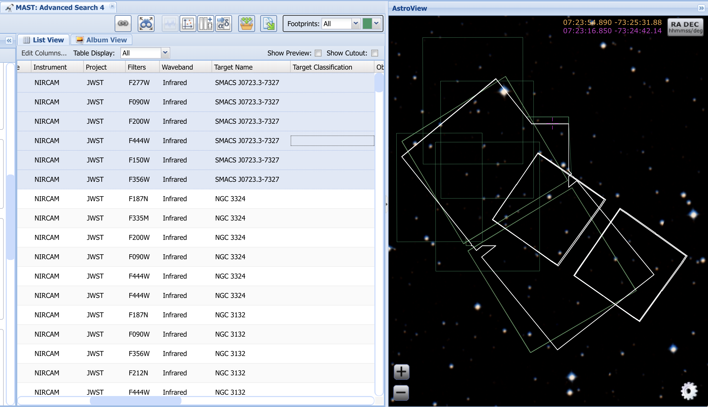

# JWST ERO data

### Very useful public scripts by some awesome researcher(s)

[https://stpubdata-jwst.stsci.edu/](https://stpubdata-jwst.stsci.edu/)

| Project   | Program ID | Uncalibrated | Calibrated | Guidestar |
| ---       | ---        | ---          | ---        | ---       |
| ERO | 02731 | jw02731_dl-uncal.sh | jw02731_dl-cal.sh | jw02731_dl-guidestar.sh |
| ERO | 02732 | jw02732_dl-uncal.sh | jw02732_dl-cal.sh | jw02732_dl-guidestar.sh |
| ERO | 02733 | jw02733_dl-uncal.sh | jw02733_dl-cal.sh | jw02733_dl-guidestar.sh |
| ERO | 02734 | jw02734_dl-uncal.sh | jw02734_dl-cal.sh | jw02734_dl-guidestar.sh |
| ERO | 02736 | jw02736_dl-uncal.sh | jw02736_dl-cal.sh | jw02736_dl-guidestar.sh |

### MAST query info for SMACS J0723.3-7327, program 2736

