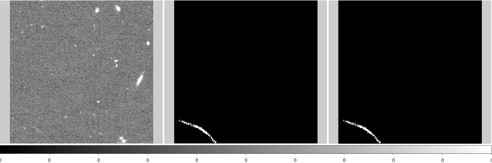
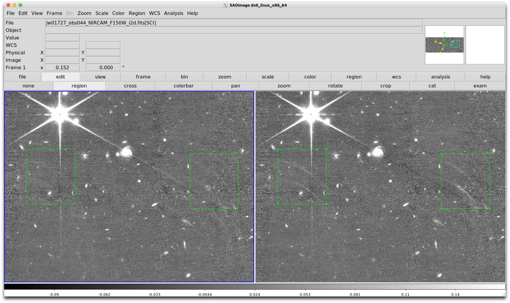
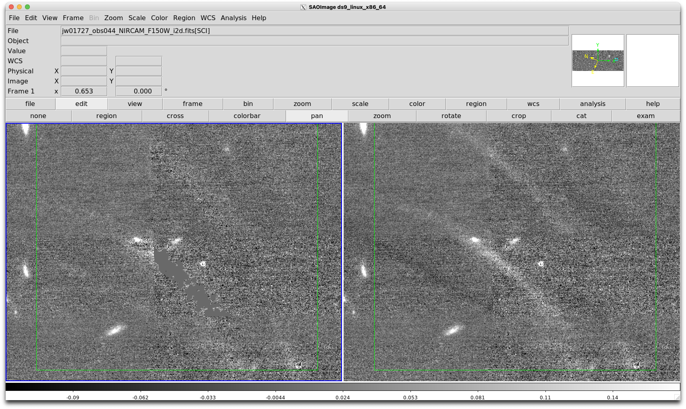

# Example of removing claws

## Step 1, visual inspection

First open DS9 and have a look at the cal images:

```
ds9 -lock frame image -scale zscale jw01727044001_04101_0000*_cal.fits
```

Then manually draw DS9 polygon regions and save them in pixel (image) coordinates for example as following files:

```
jw01727044001_04101_00001_nrcb1_cal_claws.pix.reg
jw01727044001_04101_00002_nrcb1_cal_claws.pix.reg
jw01727044001_04101_00003_nrcb1_cal_claws.pix.reg
jw01727044001_04101_00004_nrcb1_cal_claws.pix.reg
```


## Step 2, generating claw emission mask image

Then we run the following code: 

(assuming you have the `/path/to/Crab.Toolkit.JWST/bin` path in your system variable `$PATH` so that commands below can be executed in the command line)

```
for expo in 00001 00002 00003 00004; do

    # We run the following script to detect the claw emission mask.
    # The region file is input with the `--include-region` argument 
    # so that emission will be detected only within the input region area, 
    # that is, the claws emission. 
    # A smoothing with sigma of 1 pixel is specifed by the `--smooth` argument. 
    
    util_detect_source_and_create_seed_image.py \
        jw01727044001_04101_${expo}_nrcb1_cal.fits \
        --include-region jw01727044001_04101_${expo}_nrcb1_cal_claws.pix.reg \
        --output-suffix "_claws_seed_image" \
        --minpixarea 1 --ignore-background --sigma 2 --smooth 1 --overwrite

    # Let's open DS9 and have a look at the claws
    
    ds9 -tile grid layout 3 1 -width 1200 -height 350 -lock frame image -scale zscale \
        jw01727044001_04101_${expo}_nrcb1_cal.fits \
        jw01727044001_04101_${expo}_nrcb1_cal_claws_seed_image.fits \
        jw01727044001_04101_${expo}_nrcb1_cal_claws_seed_image_zeroonemask.fits \
        -zoom to fit \
        -saveimage eps jw01727044001_04101_${expo}_nrcb1_cal_claws.eps

    # compress it as *.fits.gz
    
    gzip -k jw01727044001_04101_${expo}_nrcb1_cal_claws_seed_image_zeroonemask.fits

    echo "Output mask file: jw01727044001_04101_${expo}_nrcb1_cal_claws_seed_image_zeroonemask.fits.gz"

done
```

A screenshot of the DS9 display above is as below. First panel is the input cal image. Second and third panels are the detected and smoothed claw emission mask. The mask file with a name suffix "zeroonemask" means that it is a 0-1 mask, whereas the one without that suffix has float pixel values from 0 to 1 because of the `--smooth` parameter. Smoothing more will get the final claw mask bigger, but it needs some trials. 




## Step 3, applying to the rate data file.

Then we can apply the claw mask to "rate.fits" files. For each rate file with a corresponding claw mask file, we can open the rate file with `jwst.datamodels.ImageModel()` then set `model.dq = np.bitwise_or(model.dq, claw_mask.astype(int))`, e.g., as below. 

```
from astropy.nddata.bitmask import interpret_bit_flags
from jwst.datamodels.dqflags import pixel as dqflags_pixel
from jwst.datamodels import ImageModel, FlatModel, dqflags
from stdatamodels import util


# Read claw mask image

seed_image_file = 'jw01727044001_04101_00001_nrcb1_cal_claws_seed_image_zeroonemask.fits.gz'
seed_image, seed_image_header = fits.getdata(seed_image_file, header=True)

# prepare a `seed_mask` array, which indicates the status flag of a pixel
# here I choose some arbitrary combination of bad pixel states.

seed_mask = interpret_bit_flags(
    'DO_NOT_USE+UNRELIABLE_DARK+UNRELIABLE_FLAT+OTHER_BAD_PIXEL',
    flag_name_map=dqflags_pixel
)

# open rate file for update (backup it first!!)

ratefile = 'jw01727044001_04101_00001_nrcb1_rate.fits'

timestamp = datetime.datetime.now().strftime('%Y-%m-%d %H:%M:%S')

with ImageModel(ratefile) as model:

    # check if already processed
    for entry in model.history:
        for k,v in entry.items():
            if v.startswith('Removed claws'):
                logger.info('{!r} already had claws removed. Skipping!'.format(ratefile))
                return
    
    # set DQ to the pixels with seed emission mask
    model.dq[seed_mask] = np.bitwise_or(
        model.dq[seed_mask], 
        seed_dq
    )
    
    model.data[seed_mask] = 0.0
    
    # add history entry following CEERS
    CODE_NAME = 'CODE_NAME'
    stepdescription = f'Removed claws with {CODE_NAME} ({timestamp})'
    software_dict = {'name':'CODE_NAME',
                     'author':'CODE_AUTHOR',
                     'version':'CODE_VERSION',
                     'homepage':'CODE_HOMEPAGE'}
    substr = util.create_history_entry(stepdescription, software=software_dict)
    model.history.append(substr)
    model.save(ratefile)
    logger.info('Saved claws-removed data into {!r}'.format(ratefile))

```

Then process the rate data again with calwebb_image2 to get the cal data, then we can do calwebb_image3 to make drizzled mosaics. It needs sufficient dithering to fill the invalid pixels masked by the claw mask, otherwise we will see these invalid pixels as zero-value pixels in the final drizzled mosaics. 


## Example results

Left image is the mosaic with claw mask applied to the rate data, and right image is the default mosaic: 



Zoom-in of the previous figure: 




